# Seattle Bike Share - Analysis Findings & Recommendations

**Prepared by:** Data Analytics Team, VeloCity Urban Mobility Co.
**Dashboard:** Seattle Bike Share Explorer
**Data Period:** 2014 - 2016 (Pronto Cycle Share Network)
**Total Trips Analyzed:** 286,857 across 58 stations

---

This analysis was conducted using the publicly available Pronto Cycle Share dataset. Pronto was Seattle's first docked bike share system, operating from 2014 to 2017.
Link: https://www.kaggle.com/datasets/city-of-seattle/seattle-pronto-cycle-share-data

---

## Executive Summary

This report presents key findings from an analysis of Seattle's Pronto bike share network across two years of operations. The analysis examined rider behavior, network performance, and environmental factors that drive or suppress ridership. The goal is to surface actionable insights that can inform station planning, membership growth strategy, and operational readiness.

The network logged **286,857 total trips** across **58 stations**, with an average trip duration of **19.6 minutes**. Annual members accounted for the large majority of activity, and ridership showed strong sensitivity to both temperature and season.

---

## Dashboard Overview

The Seattle Bike Share Explorer is a five-page interactive dashboard covering station geography, trip patterns, rider demographics, weather impact, and individual station profiles.

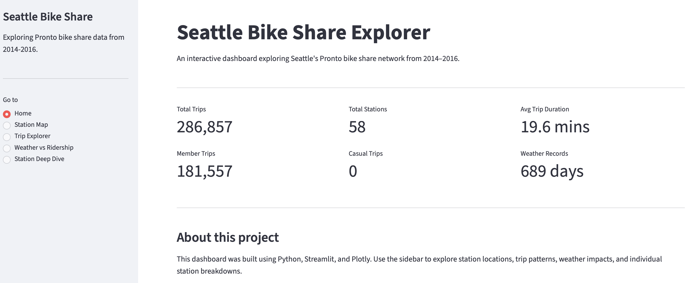
*Home page showing key network metrics at a glance.*

---

## Finding 1 - The Network Is Geographically Concentrated Downtown

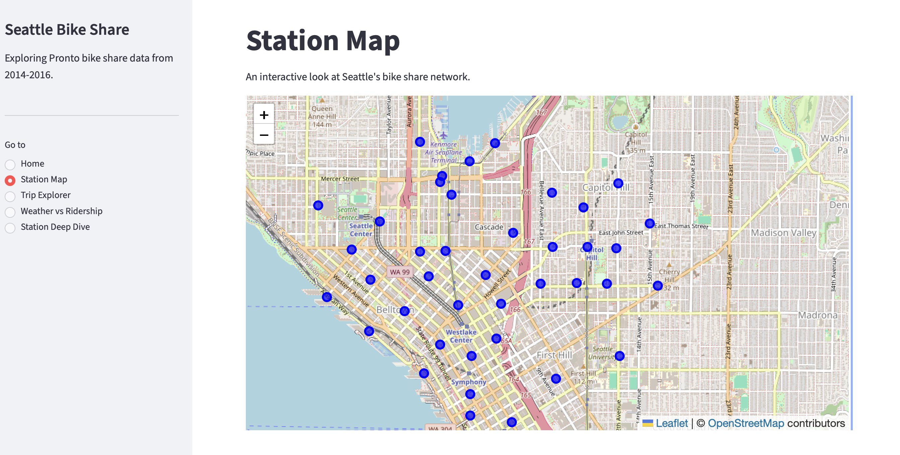
*All 58 Pronto stations mapped across Seattle. The network is tightly clustered in downtown, Capitol Hill, and the waterfront corridor.*

The station map reveals that the Pronto network was intentionally dense in central Seattle, particularly along the waterfront, through downtown, and into Capitol Hill. This concentration made the network highly efficient for short urban trips but left large residential and commercial areas of the city without coverage.

**What this means for the business:**
Coverage gaps are both a limitation and an opportunity. Expanding into underserved neighborhoods, particularly South Lake Union, the University District, and South Seattle — would increase total addressable ridership and reduce the network's dependence on a small geographic footprint.

---

## Finding 2 - A Small Number of Stations Drive the Majority of Trips

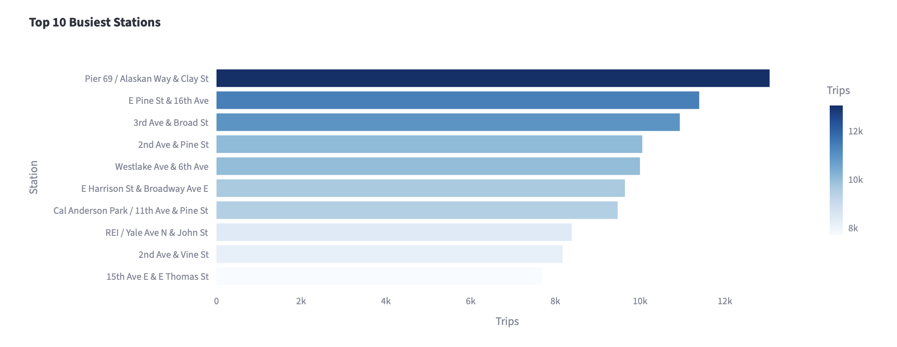
*Pier 69 / Alaskan Way & Clay St leads all stations with over 13,000 departures, nearly double the volume of stations ranked 8th–10th.*

Trip departures are heavily concentrated. Pier 69 at the waterfront is the single busiest station by a wide margin, followed by E Pine St & 16th Ave and 3rd Ave & Broad St. The top 10 stations collectively represent a disproportionate share of total network activity.

**What this means for the business:**
Dock shortages or maintenance downtime at these stations has an outsized impact on the entire system. These locations should be first in line for capacity reviews, real-time availability monitoring, and proactive rebalancing. A failure at Pier 69 is not equivalent to a failure at a lower-volume station, it affects the network's overall performance rating.

---

## Finding 3 - Members Dominate Ridership; Short-Term Riders Are an Untapped Pipeline

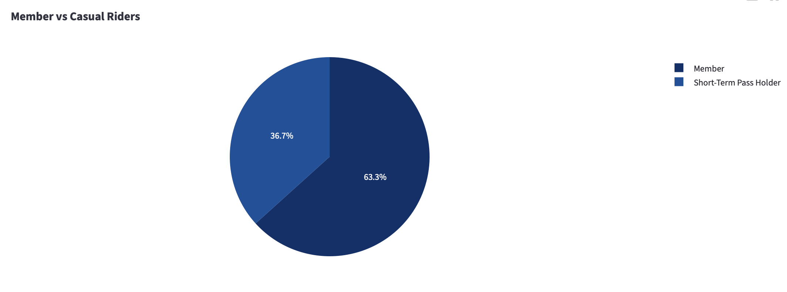
*63.3% of trips were taken by annual members. Short-term pass holders account for 36.7%.*

Annual members make up nearly two-thirds of all trips. Short-term pass holders, likely tourists, occasional users, and people evaluating the service, account for the remaining 36.7%. Notably, the home page shows **0 casual trips** under a separate "Casual Trips" metric, suggesting the data distinguishes between pass types in different ways across the dataset.

**What this means for the business:**
The member base is the engine of the network. However, short-term riders represent the clearest conversion opportunity. A rider who uses a day pass three times is a strong candidate for an annual membership, but only if there's a deliberate funnel in place. Targeted follow-up, trial membership offers, and in-app conversion prompts at the point of pass expiration could meaningfully grow the subscriber base.

---

## Finding 4 - 77% of Riders Are Male; Female Ridership Is Significantly Underrepresented

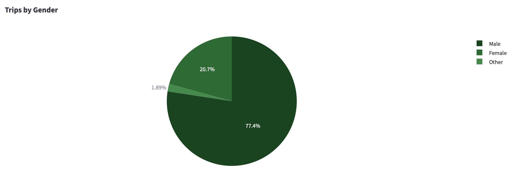
*77.4% of trips are attributed to male riders. Female riders account for 20.7%, with 1.89% identifying as other.*

The gender split is stark, male riders account for more than three-quarters of all trips. This pattern is common in bike share networks nationally but still represents a measurable gap relative to Seattle's general population.

**What this means for the business:**
Female ridership is an underserved segment with real growth potential. Research consistently shows that women's cycling rates respond positively to infrastructure improvements — particularly protected lanes, well-lit routes, and station placement near destinations perceived as safe and accessible. Closing even half of this gap would represent a meaningful increase in total ridership.

---

## Finding 5 - The Core Rider Is Between 25 and 35 Years Old

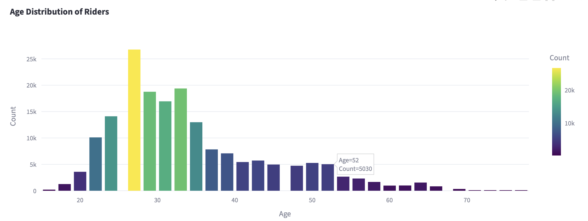
*Ridership peaks sharply at age 28, with strong representation through the mid-30s. Volume drops steadily after 40.*

The age distribution is right-skewed toward younger adults. The single largest cohort is riders around age 28, with significant volume continuing through the mid-30s. Ridership above 50 exists but is comparatively modest.

**What this means for the business:**
The product resonates most strongly with younger working professionals, consistent with a commuter-driven use case. Riders over 50 are an underleveraged segment. Programming aimed at recreational riders, older commuters, or e-bike integration could broaden the age curve and increase lifetime customer value across cohorts.

---

## Finding 6 - Temperature Has a Direct, Measurable Impact on Daily Ridership

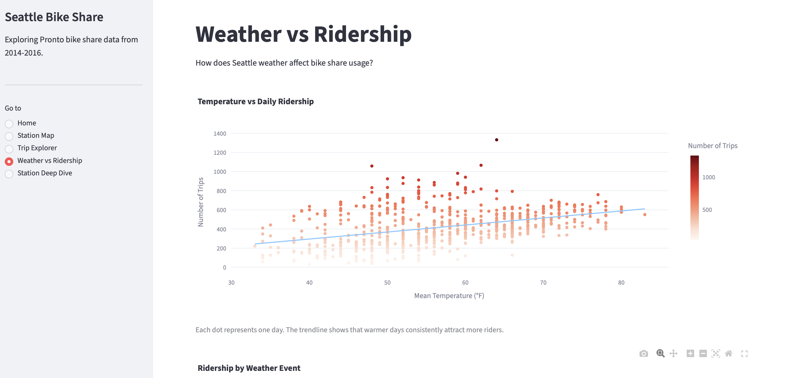
*Each dot represents one day. The trendline confirms a consistent positive relationship between mean temperature and trip volume across the full dataset.*

Warmer days produce more trips,consistently. The scatter plot shows wide variance on any given day, but the trendline across nearly two years of data is unambiguous: as temperature rises, ridership follows. Days above 60°F frequently exceed 600–800 trips, while days below 40°F cluster near or below 300.

**What this means for the business:**
Demand is partially predictable through weather forecasting. Operations teams can use temperature outlooks to schedule rebalancing in advance, align staffing to anticipated demand, and set realistic daily and weekly ridership targets. This also makes the case for weather-responsive communications, a "great day to ride" push notification tied to a forecast above 65°F costs almost nothing and could drive meaningful lift.

---

## Finding 7 - Rain, Snow, and Thunderstorms Measurably Suppress Ridership

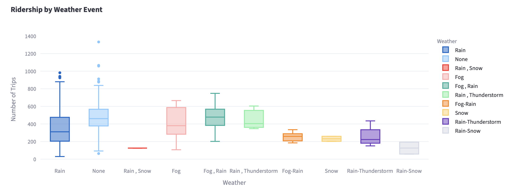
*Clear days ("None") produce the highest median trip counts and the widest upside range. Rain-Snow and Rain-Thunderstorm combinations show the lowest floors.*

Weather events compress the ridership range from above and below. On clear days, trip counts span from roughly 100 to over 1,300, the full distribution. On rain-snow or thunderstorm days, the ceiling drops significantly and the floor falls to near zero. Standard rain days fall somewhere in between, with a meaningfully lower median than clear days.

**What this means for the business:**
Seattle's climate creates structural seasonality that cannot be fully overcome, but it can be planned around. Covered bike parking at the top 10 stations, weather-based discounts during low-demand periods, and off-season membership retention programs are all levers that could smooth the revenue curve across the year.

---

## Finding 8 - Ridership Peaked in Spring 2015 and Has Not Fully Recovered

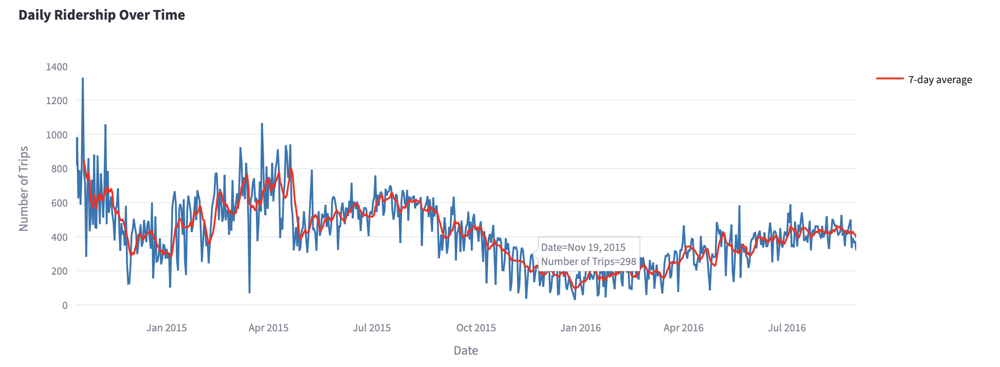
*The red 7-day rolling average shows two clear seasonal cycles. Spring 2015 represents the network's peak. The 2015–2016 winter trough was severe, with some days falling below 100 trips. Recovery in 2016 was partial.*

The time series reveals more than just seasonality, it tells a network health story. Spring 2015 saw the system's peak activity, with the 7-day average reaching nearly 800 trips per day. The following winter collapsed ridership to its lowest sustained levels in the dataset. The 2016 recovery was real but plateaued below the 2015 peak, suggesting possible network fatigue, competitive alternatives emerging, or a membership base that didn't grow between years.

**What this means for the business:**
Year-over-year retention is a key metric that this data raises questions about. The 2016 numbers suggest the network may have been losing members without replacing them at an equal rate, a dynamic that, if unaddressed, leads to the kind of system-wide decline that ultimately ended Pronto's operations in 2017.

---

## Finding 9 - Popular Routes Reveal Both Commuter Corridors and Recreational Loops

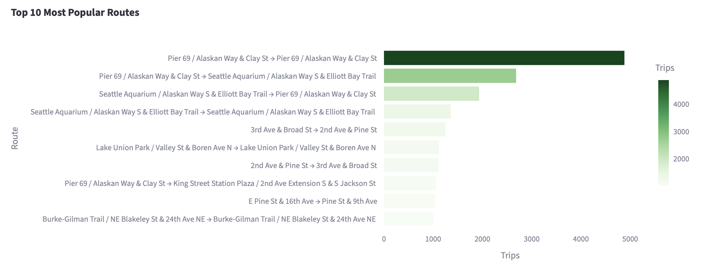
*The single most common trip is Pier 69 back to Pier 69, a round trip, with nearly 5,000 occurrences. Waterfront routes between Pier 69 and the Seattle Aquarium dominate the top 5.*

The most frequently taken routes split into two distinct patterns. The top route, Pier 69, to itself is a recreational loop, almost certainly tourists or leisure riders exploring the waterfront. The next cluster involves back-and-forth trips between Pier 69 and the Seattle Aquarium, further reinforcing the recreational nature of waterfront activity. Commuter-style point-to-point routes (3rd Ave & Broad St to 2nd Ave & Pine St) appear further down the list.

**What this means for the business:**
The waterfront is a tourism asset, not just a transit corridor. Partnerships with the Seattle Aquarium, Pike Place Market, and waterfront hospitality venues could drive co-branded promotions and increase casual ridership in one of the system's most active zones. Simultaneously, the commuter routes that do appear suggest there is a transit-integration story to tell with employers and transit agencies.

---

## Finding 10 - Individual Stations Show Highly Distinct Demand Patterns

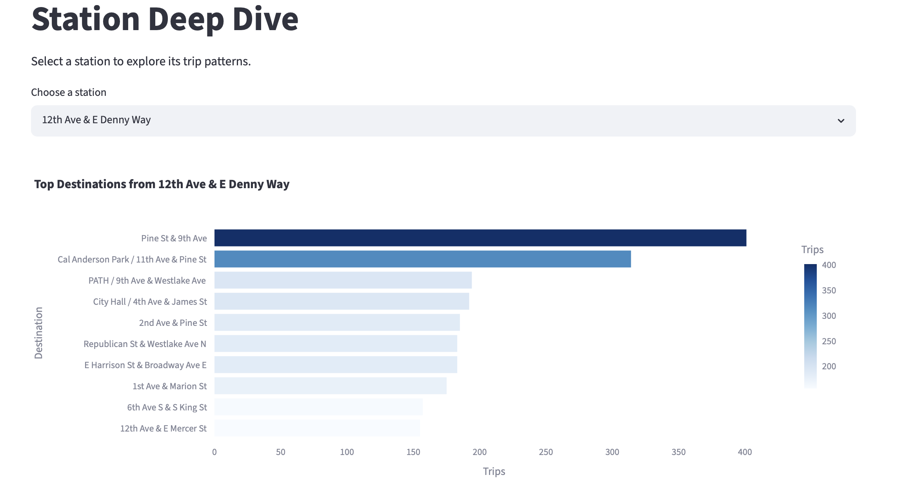
*From 12th Ave & E Denny Way, the dominant destination is Pine St & 9th Ave, a clear directional commute pattern toward downtown.*

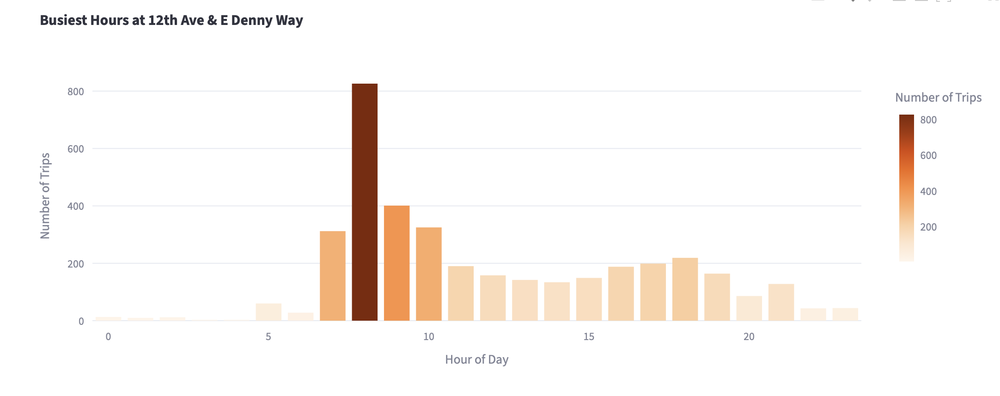
*This station's demand is sharply concentrated at 8am, with a secondary peak at 9am — a classic commuter signature. Midday and evening activity is comparatively flat.*

The Station Deep Dive view exposes how differently individual stations behave. At 12th Ave & E Denny Way, the 8am spike is unambiguous — this is a station used almost exclusively for the morning commute. Other stations in the network show midday peaks, suggesting recreational or errand-based use cases.

**What this means for the business:**
A uniform rebalancing schedule treats all stations the same, which this data shows is the wrong approach. Commuter stations need bikes stocked by 7:30am and emptied by 9:30am. Recreational stations need the opposite. Station-level demand modeling, even at a basic level, could significantly improve system availability without increasing the total number of bikes in the fleet.

---

## Recommendations Summary

| Priority | Recommendation |
|---|---|
| 🔴 High | Protect uptime and dock availability at Pier 69 and the top 10 busiest stations — they carry the network |
| 🔴 High | Build a short-term-to-member conversion funnel, especially along the waterfront tourist corridor |
| 🟡 Medium | Implement weather-responsive operations — use temperature forecasts to schedule rebalancing and maintenance |
| 🟡 Medium | Develop station-level demand profiles to replace generic rebalancing with targeted, time-aware redistribution |
| 🟡 Medium | Investigate barriers to female ridership; infrastructure and safety improvements have the highest evidence base |
| 🟢 Low | Explore off-season engagement programs (loyalty perks, reduced winter rates) to reduce churn during cold months |
| 🟢 Low | Pursue waterfront partnership opportunities (Aquarium, Pike Place) to convert tourist riders into recurring users |

---

## Notes on the Data

The dataset covers Pronto Cycle Share operations from late 2014 through 2016. Pronto was Seattle's first docked bike share system and ceased operations in 2017. Gender and birth year were self-reported at member registration and are absent for most short-term pass trips, demographic findings should be read as directional rather than precise population estimates. The "Casual Trips: 0" figure on the home page reflects a specific usertype label in the dataset and does not mean no non-member trips occurred.

---

*Prepared by the VeloCity Urban Mobility Co. Data Analytics Team.*
